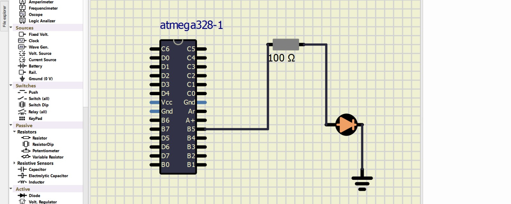

# Lab 1: RADU_BALC

Link to your `Digital-electronics-2` GitHub repository:

   Balc Radu's repository is [here](https://github.com/balc-radu/Digital-Electronics-2).


### Blink example

1. What is the meaning of the following binary operators in C?
   * `|` - OR operator
   * `&` - AND operator
   * `^` - XOR operator
   * `~` - NOT operator, 1's complement
   * `<<` - LEFT SHIFT BIT WISE
   * `>>` - RIGHT SHIFT BIT WISE

2. Complete truth table with operators: `|`, `&`, `^`, `~`

| **b** | **a** |**b or (\|) a** | **b and (\&) a** | **b xor (\^) a** | **not (\~) b** |
| :-: | :-: | :-: | :-: | :-: | :-: |
| 0 | 0 | 0 | 0 | 0 | 1 |
| 0 | 1 | 1 | 0 | 1 | 1 |
| 1 | 0 | 1 | 0 | 1 | 0 |
| 1 | 1 | 1 | 1 | 0 | 0 |


### Morse code

1. Listing of C code with syntax highlighting which repeats one "dot" and one "comma" (BTW, in Morse code it is letter `A`) on a LED:

```c
/***********************************************************************
 * 
 * Blink a LED and use function from the delay library.
 * ATmega328P (Arduino Uno), 16 MHz, AVR 8-bit Toolchain 3.6.2
 *
 * Copyright (c) 2018-2021 Tomas Fryza 
 * Dept. of Radio Electronics, Brno University of Technology, Czechia
 * This work is licensed under the terms of the MIT license.
 * 
 **********************************************************************/

/* Defines -----------------------------------------------------------*/
/* The preprocessor will process directives that are inserted into the C
 * source code. These directives allow additional actions to be taken on
 * the C source code before it is compiled into object code. Directives
 * are not part of the C language itself.
 *
 * Preprocessor directives begin with a pound (#) symbol and may have 
 * several arguments. Do NOT put a semicolon character at the end of 
 * directives. This is a common mistake.
 */
#define LED_GREEN   PB5 // AVR pin where green LED is connected
#define SHORT_DELAY 1000 // Delay in milliseconds
#ifndef F_CPU           // Preprocessor directive allows for conditional
                        // compilation. The #ifndef means "if not defined".
# define F_CPU 16000000 // CPU frequency in Hz required for delay
#endif                  // The #ifndef directive must be closed by #endif

/* Includes ----------------------------------------------------------*/
/* Include another C language file into the current file at the location
 * of the #include statement prior to compiling the source code.
 */
#include <util/delay.h> // Functions for busy-wait delay loops
#include <avr/io.h>     // AVR device-specific IO definitions

/* Function definitions ----------------------------------------------*/
/**********************************************************************
 * Function: Main function where the program execution begins
 * Purpose:  Toggle one LED and use delay library.
 * Returns:  none
 **********************************************************************/

int main(void)
{
	// Set pin as output in Data Direction Register
	// DDRB = DDRB or 0010 0000
	DDRB = DDRB | (1<<LED_GREEN);

	// Set pin LOW in Data Register (LED off)
	// PORTB = PORTB and 1101 1111
	PORTB = PORTB & ~(1<<LED_GREEN);

	// Infinite loop
	while (1)
	{
		// Pause several milliseconds
		_delay_ms(SHORT_DELAY);
		//we start with a short delay so when the code loops we have a break between the flashes, this could be deleted and added at the end
		//MY CODE :
		
		// we make the LED flash
		PORTB = PORTB ^(1<<LED_GREEN);  // this is the . ( point )
		// we add a delay
		_delay_ms(SHORT_DELAY);
		
		// we turn the LED OFF
		PORTB = PORTB & ~(1<<LED_GREEN);
		// we add another delay
		_delay_ms(SHORT_DELAY);
		
		// we make the LED flash for longer
		PORTB = PORTB ^(1<<LED_GREEN);  // this is the . ( point )
		// we add another delay, longer, so we can have the "dash" -
		_delay_ms(2 * SHORT_DELAY);
		// we turn the LED OFF once again
		PORTB = PORTB & ~(1<<LED_GREEN);
		
		// we have "plotted" a . and a -, thereofre, we have a MORSE code A letter.

	}

	// Will never reach this
	return 0;
}
```


2. Scheme of Morse code application, i.e. connection of AVR device, LED, resistor, and supply voltage. The image can be drawn on a computer or by hand. Always name all components and their values!

   
