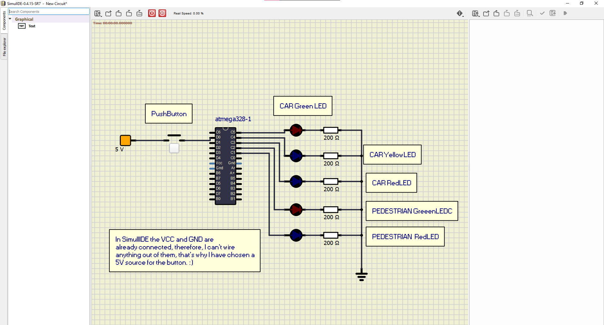

# Lab 3: RADU_BALC
Link to your `Digital-electronics-2` GitHub repository:

   [Click me to go to the DE2 repository of Balc Radu !](https://github.com/balc-radu/Digital-Electronics-2)


### Data types in C

1. Complete table.

| **Data type** | **Number of bits** | **Range** | **Description** |
| :-: | :-: | :-: | :-- | 
| `uint8_t`  | 8 | 0, 1, ..., 255 | Unsigned 8-bit integer |
| `int8_t`   | 8 | -127...128 | 	Signed integer type of exactly 8 bits |
| `uint16_t` | 16 | 0...+65535 | Unsigned integer type of exactly 16 bits |
| `int16_t`  | 16 | -32768...+32767 | Signed integer type of exactly 16 bits |
| `float`    | 32 | -3.4e+38, ..., 3.4e+38 | Single-precision floating-point |
| `void`     | it has no size | it has no range | Empty data type, it represents the lack of a data type |


### GPIO library

1. In your words, describe the difference between the declaration and the definition of the function in C.

  **Function declaration**
   - A declaration introduces a new "identifier", such as a letter/word that has a type. We declare functions in order for the compiler to find references of this "identifier".
    Basically, a function declaration introduces a identifier name that has a type and formal parameters
    
     Example:
     
  ```c
    double nameOfFunction(int,double,float);
  ```
    
  **Function definition**
   - A definition actually implements the function for the certain "identifier" declared. Basically, a function definition uses the identifier name and adds actual parameters with their own identifiers, 
   the function definition is what makes the function be useful and allows it to perform the code written by the dev.
    
   Example :

```c
     double nameOfFunction( int age, double cash, float price )
     { cout << "The age is " <<age<< " and the price is "<<price<<" with money remaining  : "<<cash;
 ```
     
2. Part of the C code listing with syntax highlighting, which toggles LEDs only if push button is pressed. Otherwise, the value of the LEDs does not change. Use function from your GPIO library. Let the push button is connected to port D:

   We use the gpio.h header file and gpio.c file for the main.c file for easier declaration and implementation of the code.

```c
    // Configure Push button at port D and enable internal pull-up resistor
    // WRITE YOUR CODE HERE

   /*********************************************************************** *
* Alternately toggle two LEDs when a push button is pressed. Use * functions from GPIO library. 
* ATmega328P (Arduino Uno), 16 MHz, AVR 8-bit Toolchain 3.6.2 * * Copyright (c) 2019-2020 Tomas Fryza 
* Dept. of Radio Electronics, Brno University of Technology, Czechia
* This work is licensed under the terms of the MIT license. 
* **********************************************************************/
/* Defines -----------------------------------------------------------*/ 
#define BUTTONHW PD0 // AVR pin where button is connected , the requirement of the papers states port D
#define WHITE_LED PB5 // AVR pin where green LED is connected
#define BLUE_LED PB0 // AVR pin where red LED is connected 
#define BLINK_DELAY 500
#ifndef F_CPU 
#define F_CPU 16000000 // CPU frequency in Hz required for delay 
#endif
/* Includes ----------------------------------------------------------*/ 
#include <util/delay.h> // Functions for busy-wait delay loops 
#include <avr/io.h> // AVR device-specific IO definitions 
#include "gpio.h" // GPIO library for AVR-GCC
/* Function definitions ----------------------------------------------*/ /** 
* Main function where the program execution begins. 
Toggle two LEDs * when a push button is pressed. 
Functions from user-defined GPIO * 
library is used instead of low-level logic operations. */
int main(void) {
    
//  WHITE LED
GPIO_config_output(&DDRB, WHITE_LED); // we configure the white led as ouput on port PB5
GPIO_write_high(&PORTB, WHITE_LED);  // we write it as high, this is on at the moment of execution 

//  BLUE LED 

GPIO_config_output(&DDRC, BLUE_LED); // we configure the white led as ouput on port PB0
GPIO_write_low(&PORTC, BLUE_LED);  // we write it as low, this is off at the moment of execution 
 
//  PORT D BUTTON 

GPIO_config_input_pullup(&DDRD, BUTTONHW);  // we oconfigure the push button on port D(PD0) as asked, for input

// Infinite loop 

while (1){ 
    // Pause several milliseconds
    _delay_ms(BLINK_DELAY); 
    
    if (GPIO_read(&PIND, BUTTONHW) == 0)  // " if we 'read' the button as pushed
        { 
            // we toggle between the states of the led, so, white become low, blue becomes high
         GPIO_toggle(&PORTB, WHITE_LED);
         GPIO_toggle(&PORTC, BLUE_LED); 
         
        }
          } // Will never reach this
    return 0; 
    
}
```


### Traffic light

1. Scheme of traffic light application with one red/yellow/green light for cars and one red/green light for pedestrians. Connect AVR device, LEDs, resistors, one push button (for pedestrians), and supply voltage. The image can be drawn on a computer or by hand. Always name all components and their values!

   
