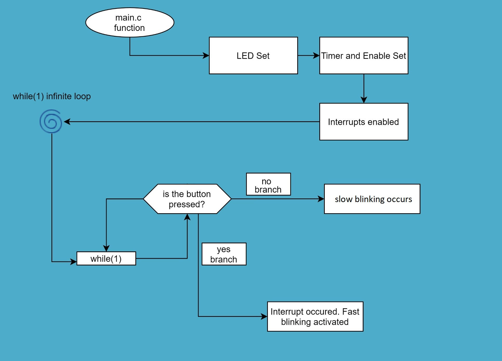
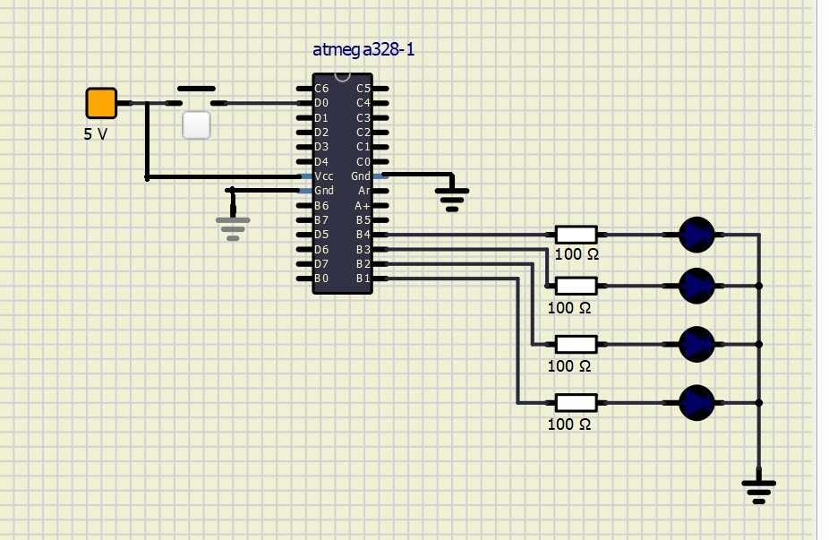

# Lab 4:  RADU_BALC

Link to your `Digital-electronics-2` GitHub repository:

[Click me to go to the DE2 repository of Balc Radu !](https://github.com/balc-radu/Digital-Electronics-2)


### Overflow times

1. Complete table with overflow times.

| **Module** | **Number of bits** | **1** | **8** | **32** | **64** | **128** | **256** | **1024** |
| :-: | :-: | :-: | :-: | :-: | :-: | :-: | :-: | :-: |
| Timer/Counter0 | 8  | 16u | 128u | -- | 1ms | -- | 4.1ms | 16.4ms |
| Timer/Counter1 | 16 |   4.1ms  |   33ms   | -- | 262.1ms | -- | 1.04s | 4.2s |
| Timer/Counter2 | 8  | 16u | 128u | 512u | 1ms | 2ms | 4.1ms | 16.4ms |

### Timer library

1. In your words, describe the difference between common C function and interrupt service routine.
   * Function

The function in C is called in the main programme and gets executed. It is usually decalred beforehand in a header file or below the "main" function, which contains the whole set of instructions to be executed.
   * Interrupt service routine

The main difference between C function and ISR consists in the way they get "called". Functions are syncrhonous.

ISR code gets executed automatically when an EVENT intrerrupt is activated in the hawrdware departament ( processor exception signals, peripherals, ...), which means ans ISR is asyncrhonous.

ISR will not return anything and it has no parameters, the normal function does have both ( return a value, has parameters ).

The ISR will be "called" when an interrupt happens.


2. Part of the header file listing with syntax highlighting, which defines settings for Timer/Counter0:

```c
#ifndef TIMER_H
# define TIMER_H
/**
 * @name  Definitions of Timer/Counter0
 * @note  F_CPU = 16 MHz
 */
// WRITE YOUR CODE HERE

/**

 * @name  Definitions of Timer/Counter0
 * @note  F_CPU = 16 MHz
 */
// WRITE YOUR CODE HERE
#define TIM0_stop()           TCCR0B &= ~((1<<CS02) | (1<<CS01) | (1<<CS00));
/** @brief Set overflow 16u, prescaler 001 --> 1 */
#define TIM0_overflow_16u()   TCCR0B &= ~((1<<CS02) | (1<<CS01)); TCCR0B |= (1<<CS00);
/** @brief Set overflow 128u, prescaler 010 --> 8 */
#define TIM0_overflow_128us()  TCCR0B &= ~((1<<CS02) | (1<<CS00)); TCCR0B |= (1<<CS01);
/** @brief Set overflow 1ms, prescaler 011 --> 64 */
#define TIM0_overflow_1ms()    TCCR0B &= ~(1<<CS02); TCCR0B |= (1<<CS01) | (1<<CS00);
/** @brief Set overflow 4ms, prescaler 100 --> 256 */
#define TIM0_overflow_4ms()    TCCR0B &= ~((1<<CS01) | (1<<CS00)); TCCR0B |= (1<<CS02);
/** @brief Set overflow 16ms, prescaler // 101 --> 1024 */
#define TIM0_overflow_16ms()    TCCR0B &= ~(1<<CS01); TCCR0B |= (1<<CS02) | (1<<CS00);
/** @brief Enable overflow interrupt, 1 --> enable */
#define TIM0_overflow_interrupt_enable()  TIMSK0 |= (1<<TOIE0);
/** @brief Disable overflow interrupt, 0 --> disable */
#define TIM0_overflow_interrupt_disable() TIMSK0 &= ~(1<<TOIE0);
/** @} */

#endif
```

3. Flowchart figure for function `main()` and interrupt service routine `ISR(TIMER1_OVF_vect)` of application that ensures the flashing of one LED in the timer interruption. When the button is pressed, the blinking is faster, when the button is released, it is slower. Use only a timer overflow and not a delay library. The image can be drawn on a computer or by hand. Use clear descriptions of the individual steps of the algorithms.

   


### Knight Rider

1. Scheme of Knight Rider application with four LEDs and a push button, connected according to Multi-function shield. Connect AVR device, LEDs, resistors, push button, and supply voltage. The image can be drawn on a computer or by hand. Always name all components and their values.

   
