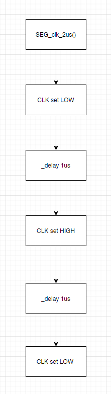

# Lab 5: RADU BALC

Link to your `Digital-electronics-2` GitHub repository:

   [Click me to go to the DE2 repository of Balc Radu !](https://github.com/balc-radu/Digital-Electronics-2)

### 7-segment library

1. In your words, describe the difference between Common Cathode and Common Anode 7-segment display.
  * CC SSD

In the Common Cathode display, all the cathode connections of the LED segments are joined together by logic 0 or ground. When we want them to turn on we will need a logic 1 or HIGH signal.
Therefore, CC SSD is active HIGH.
  
  * CA SSD


In the Common Cathode display, all the  anode connectons of the LED segments are joined together by logic 1 . When we want them to turn on we will need a logic 0 or LOW signal.
Therefore, CA SSD is active LOW.
 

2. Code listing with syntax highlighting of two interrupt service routines (`TIMER1_OVF_vect`, `TIMER0_OVF_vect`) from counter application with at least two digits, ie. values from 00 to 59:

```c
/**********************************************************************
 * Function: Timer/Counter1 overflow interrupt
 * Purpose:  Increment counter value from 00 to 59.
 **********************************************************************/
ISR(TIMER1_OVF_vect) //  262 ms
{   
    // WRITE YOUR CODE HERE
    static uint8_t val1=0,val2=0;
    
    val++;
    if(val0>9) //if the value of val0 will get to 9 it will reset to 0 and increment the value of the "tens"
        {val1=0;
        val2++;
        }
    if(val2>5)  //if the value of val2 will exceed 5 ( will reach 6 ) it will go back to 0 .
        val2=0;      
}
```

```c
/**********************************************************************
 * Function: Timer/Counter0 overflow interrupt
 * Purpose:  Display tens and units of a counter at SSD.
 **********************************************************************/
ISR(TIMER0_OVF_vect) // 4ms
{
    static uint8_t pos = 0; 
    pos++;
    if(pos>1){
        pos=0;
        SEG_update_shift_regs(val1,pos); //this instruction changes the displayed number on pos. 0
    }
    else
        SEG_update_shift_regs(val2,pos); //this instruction changes the displayed number on pos. 1
}
```

3. Flowchart figure for function `SEG_clk_2us()` which generates one clock period on `SEG_CLK` pin with a duration of 2&nbsp;us. The image can be drawn on a computer or by hand. Use clear descriptions of the individual steps of the algorithms.

   
   


### Kitchen alarm

Consider a kitchen alarm with a 7-segment display, one LED and three push buttons: start, +1 minute, -1 minute. Use the +1/-1 minute buttons to increment/decrement the timer value. After pressing the Start button, the countdown starts. The countdown value is shown on the display in the form of mm.ss (minutes.seconds). At the end of the countdown, the LED will start blinking.

1. Scheme of kitchen alarm; do not forget the supply voltage. The image can be drawn on a computer or by hand. Always name all components and their values.

   
