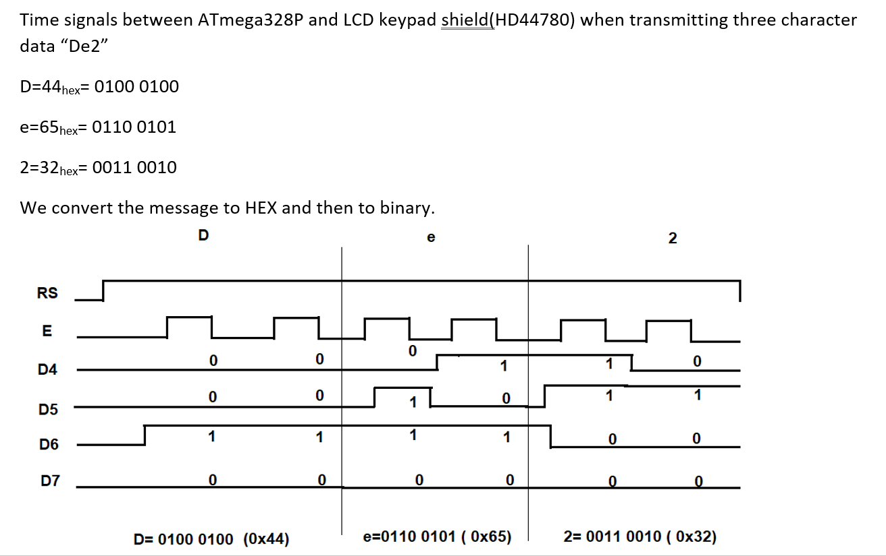

# Lab 6: RADU_BALC


   [Click me to go to the DE2 repository of Balc Radu !](https://github.com/balc-radu/Digital-Electronics-2)


### LCD display module

1. In your words, describe what ASCII table is.
 
   ASCII(American Standard Code for Information Interchange) is a character encoding standard for communication. 

   An ASCII table contains information about the representation and encoding of any character so that computers can communicate and understand each other.
   
   The ASCII table contains all the normal characters, such as alphabet letters, numbers and other types of characters, such as ETX( end of text ) and the list goes on.

2. (Hand-drawn) picture of time signals between ATmega328P and LCD keypad shield (HD44780 driver) when transmitting three character data `De2`.

   


### Stopwatch

1. Flowchart figure for `TIMER2_OVF_vect` interrupt service routine which overflows every 16&nbsp;ms but it updates the stopwatch LCD approximately every 100&nbsp;ms (6 x 16&nbsp;ms = 100&nbsp;ms). Display tenths of a second and seconds `00:seconds.tenths`. Let the stopwatch counts from `00:00.0` to `00:59.9` and then starts again. The image can be drawn on a computer or by hand. Use clear descriptions of the individual steps of the algorithms.

   


### Custom characters

1. Code listing with syntax highlighting of two custom character definition:

```c
/* Variables ---------------------------------------------------------*/
// Custom character definition
uint8_t customChar[16] = {
    // WRITE YOUR CODE HERE

};
```


### Kitchen alarm

Consider a kitchen alarm with an LCD, one LED and three push buttons: start, +1 minute, -1 minute. Use the +1/-1 minute buttons to increment/decrement the timer value. After pressing the Start button, the countdown starts. The countdown value is shown on the display in the form of mm.ss (minutes.seconds). At the end of the countdown, the LED will start blinking.

1. Scheme of kitchen alarm; do not forget the supply voltage. The image can be drawn on a computer or by hand. Always name all components and their values.

   
